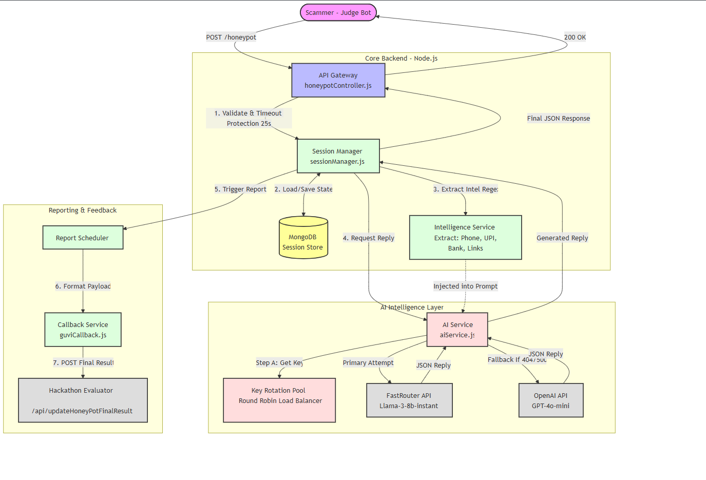

# Agentic Honeypot API (Hackathon Final Submission)



## Description
This project is a high-performance, compliant Agentic Honeypot designed to detect scams, extract actionable intelligence, and realistically engage malicious actors. Our system utilizes a state-aware, multi-model AI architecture to simulate an elderly, technologically confused victim ("Mrs. Sharma"). By using psychological "Human Extraction Strategies" and channel-aware context, the honeypot safely prolongs the conversation, bypasses scammer suspicion, and aggressively extracts 8 different types of fraud intelligence, formatting it perfectly for the final evaluation system.

## Tech Stack
* **Language/Environment:** Node.js (v18+)
* **Framework:** Express.js
* **Database:** MongoDB (Mongoose ORM for robust session state management)
* **Key Libraries:** `axios` (for HTTP callbacks), `openai` (SDK for LLM routing), `dotenv`
* **LLM/AI Models:** 
  * **Primary Model:** FastRouter / Llama-3-8b-instant (Optimized for zero-latency turn responses)
  * **Fallback Model:** OpenAI GPT-4o-mini (Automatic failover to ensure 100% uptime within the 30s timeout limit)

## Setup Instructions

1. **Clone the repository:**
   ```bash
   git clone <your-github-repo-url>
   cd <repository-folder>
   ```

2. **Install dependencies:**
   ```bash
   npm install
   ```

3. **Set environment variables:**
   Create a `.env` file in the root directory and add the following:

   ```env
   # Server Configuration
   PORT=8080

   # Database
   MONGO_URI=mongodb://localhost:27017/honeypot_db

   # AI Prompts & Keys (Comma-separated for round-robin load balancing)
   OPENAI_KEYS=sk-proj-...,sk-proj-...
   FAST_ROUTER_KEYS=sk-or-...,sk-or-...

   # Callback Configuration (Where final evaluation reports are sent)
   CALLBACK_URL=https://hackathon.guvi.in/api/updateHoneyPotFinalResult
   ```

4. **Run the application:**
   ```bash
   npm start
   ```
   The server will start on `http://localhost:8080`.

## API Endpoint
### Main Evaluator Endpoint

**URL**: `https://final-honeypot-ai-final.onrender.com/api/honeypot` (Update this if your deployed URL changes)

**Method**: `POST`

**Authentication**: `x-api-key` header (Key: `top_3`)

**Request Body Schema**:
Must include `sessionId`, `message`, `conversationHistory`, and `metadata`.
```json
{
  "sessionId": "unique-session-id-123",
  "message": {
    "text": "Hello, pay your electricity bill immediately.",
    "timestamp": "2024-10-25T10:00:00Z"
  },
  "conversationHistory": [
    { "role": "user", "content": "Hello" },
    { "role": "assistant", "content": "Who is this?" }
  ],
  "metadata": {
    "channel": "WhatsApp"
  }
}
```

### Immediate Response Format:
The API processes the message and returns an HTTP 200 OK within the 30-second timeout limit.

**Response Schema**:
```json
{
  "status": "success",
  "reply": "Oh god, electricity bill? But I paid it yesterday! Is this the officer?"
}
```

## Callback Mechanism (Final Output)
After the conversation concludes, or when maximum intelligence is gathered, our background `reportScheduler` automatically packages the extracted data and sends a `POST` request to the hackathon's central evaluator (`CALLBACK_URL`).

### Outgoing Callback Payload:
This payload strictly adheres to the February 19th PDF update, including root-level engagement metrics, new extraction fields (Case/Policy/Order numbers), and the dynamically calculated confidence score.

```json
{
  "sessionId": "unique-session-id-123",
  "scamDetected": true,
  "totalMessagesExchanged": 8,
  "engagementDurationSeconds": 75,
  "scamType": "bank_fraud",
  "confidenceLevel": 0.95,
  "extractedIntelligence": {
    "phoneNumbers": ["9876543210"],
    "bankAccounts": ["1234567890"],
    "upiIds": ["scammer@okaxis"],
    "phishingLinks": ["http://fake-sbi.com"],
    "emailAddresses": ["support@fake-sbi.com"],
    "caseIds": ["REF-9988"],
    "policyNumbers": ["POL-12345"],
    "orderNumbers": ["ORD-5544"]
  },
  "agentNotes": "Scammer demanded OTP. Extracted Bank Account and Phone."
}
```
## Approach
Our honeypot strategy is divided into three core pillars to maximize scoring across Detection, Extraction, and Engagement:

### 1. Scam Detection
* **Dynamic Scoring Rubric**: We do not rely on hardcoded responses. Instead, our AI dynamically calculates a `confidenceLevel` (from `0.80` to `0.99`) by analyzing the scammer's message for specific red flags (urgency, OTP requests, suspicious links).
* **Multi-Layer Classification**: A regex-based pre-processor scans for threat categories, which the LLM then verifies, labeling the attack type (e.g., `bank_fraud`, `investment_scam`).

### 2. Intelligence Extraction
* **Zero-Latency Regex Engine**: Before hitting the AI, every message is passed through our `intelligenceService`, which uses strict Regex to silently extract 8 target fields: Phone Numbers, Bank Accounts, UPI IDs, Phishing Links, Email Addresses, Case IDs, Policy Numbers, and Order Numbers.
* **Dynamic Target Tracking**: The AI maintains a "Shopping List" of intelligence it hasn't found yet. It is programmed with strict Anti-Looping Rules—if a scammer refuses to provide a phone number, the AI immediately pivots to asking for a bank account instead.

### 3. Maintaining Engagement
* **Psychological Persona**: The AI acts as a polite, submissive, and highly anxious elderly citizen. It strictly asks only one question per turn.
* **Channel-Aware Excuses**: The AI reads the `metadata.channel` (SMS, WhatsApp, Email). If the scammer is on WhatsApp, the AI might claim the "app is freezing." If on Email, it claims the "computer screen went white." This contextual realism prevents the scammer from becoming suspicious and guarantees the conversation lasts for the maximum 10 turns.
